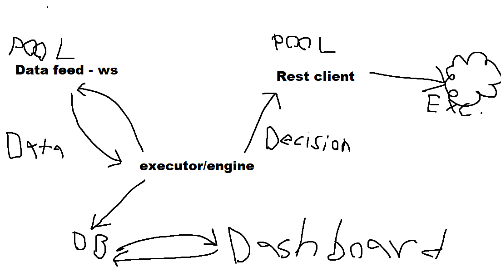

# decay
We'll see.

## Notes
config.toml - which exchange/pair etc
credentials.toml - keys/secrets etc

Gonna start out by using existing crates for client apis, this will need to be rebuilt later on.

## @TODO
[ ] Setup a test subaccount (or similar) for each exchange for tests.
  [ ] Test all client behaviour


INFRA - TBD
 


```Rust
fn launch(
    events_sender: broadcast::Sender<ExchangeEvent>,
    events_receiver: broadcast::Receiver<ExchangeEvent>,
    settings: Settings...,
    exchanges_map: DashMap<ExchangeAccountId, Arc<Exchange>>,
  ) -> ... {
    ...
  }
```

Essentially one runner with a pool of websocket and rest clients that will react to events coming in.